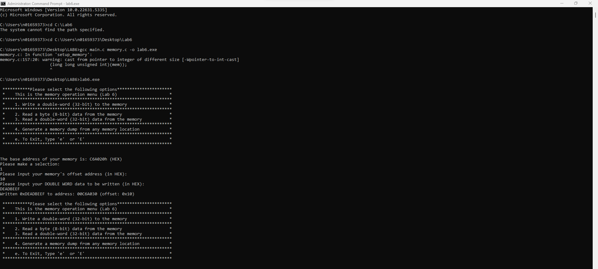
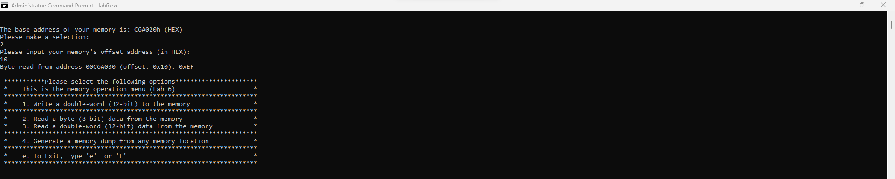
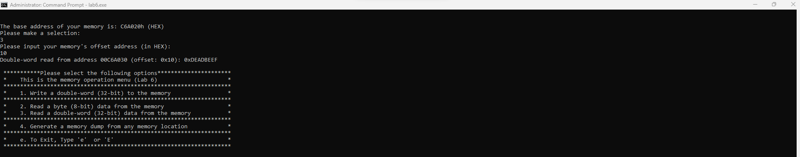
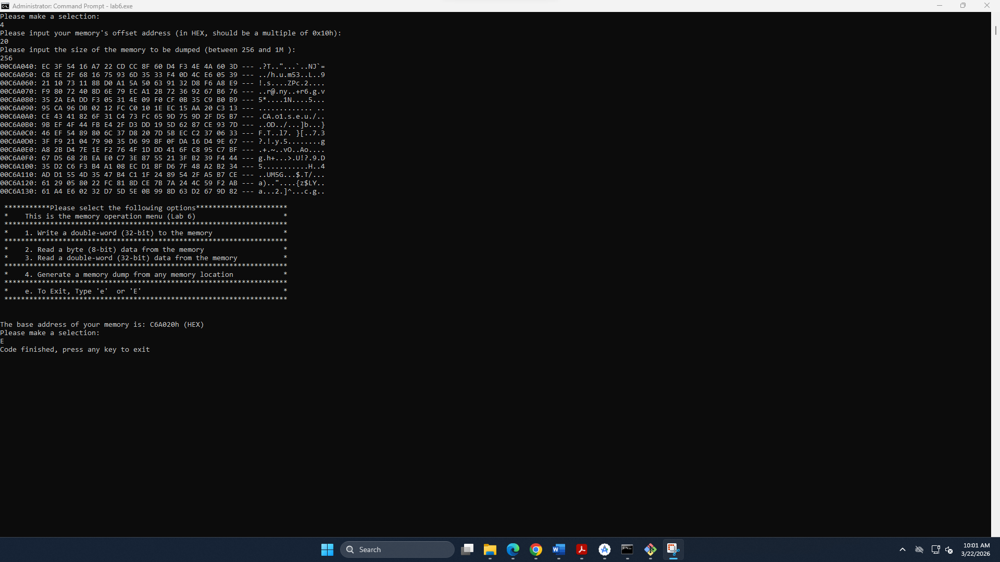

# CENG 356 - Lab 6: Memory Systems

**Student:** Solomon Ewusi  
**Student ID:** n01659373  
**Course:** CENG 356 - Computer Systems Architecture  
**Institution:** Humber College  

---

## Overview
This lab implements a memory control interface in C that simulates a 1MB memory system. The memory controller will be used in future labs for a complete computer system design and simulation.

---

## Files
| File | Description |
|------|-------------|
| `header.h` | Header file with macros and function declarations |
| `main.c` | Main entry point of the program |
| `memory.c` | Memory controller implementation (core lab work) |

---

## Features Implemented

### 1. Memory Initialization (`init_memory`)
- Allocates 1MB (1,048,576 bytes) of memory dynamically
- Fills every byte with a random value using `rand_generator()`

### 2. Write Double-Word (`write_dword`)
- Writes a 32-bit value to any address specified by `base_address + offset`
- Uses pointer casting to write all 4 bytes at once

### 3. Read Byte (`read_byte`)
- Reads a single 8-bit value from `base_address + offset`
- Returns and prints the value in HEX

### 4. Read Double-Word (`read_dword`)
- Reads a 32-bit value from `base_address + offset`
- Returns and prints the value in HEX

### 5. Memory Dump (`memory_dump`)
- Displays memory contents starting at `base_address + offset`
- Shows 16 bytes per row in HEX format
- Shows ASCII representation (non-printable characters displayed as `.`)

---

## How to Compile & Run

### Requirements
- GCC (MinGW for Windows)

### Compile
```bash
gcc main.c memory.c -o lab6.exe
```

### Run
```bash
lab6.exe
```

---

## Screenshots

### Case 1 - Write Double-Word


### Case 2 - Read Byte


### Case 3 - Read Double-Word


### Case 4 - Memory Dump


---

## Notes
- Little-endian storage: writing `0xDEADBEEF` and reading the byte at the same offset returns `0xEF` (lowest byte)
- Memory dump displays printable ASCII characters in the range `0x20` to `0x7E`
